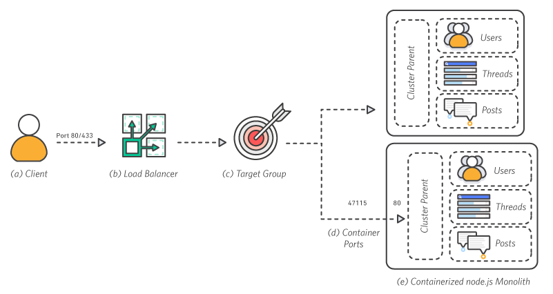

# 架构概览

**a.客户端
**客户端通过端口 80 向负载均衡器发出请求。

**b.负载均衡器
**负载均衡器会将请求分发给所有的可用端口。

**c.目标组
**实例会在应用程序的目标组中注册。

**d.容器端口
**每个容器运行一个应用程序进程，该进程会在其命名空间内将 node.js 集群父端口绑定到端口 80。

**e.使用容器封装 node.js 整体式架构
**node.js 集群父端口负责将流量分发给整体式应用程序内的工作线程。虽然此架构已经使用容器进行封装，但仍然是整体式架构，因为每个容器的功能都与其余容器相同。