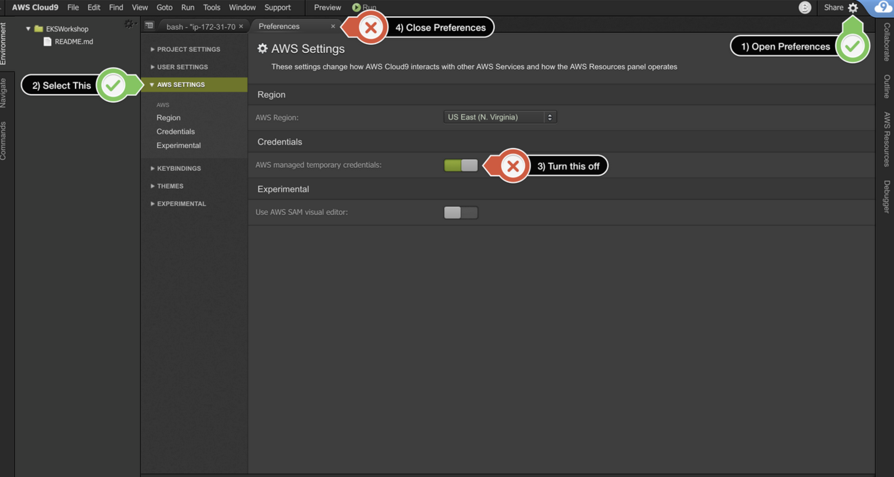

# 准备工作

#### 1.1 通过浏览器进入 https://dashboard.eventengine.run/ ，填入12位hash code，通过eventengine 进入aws控制台


#### 1.2 通过AWS Cloud9搭建服务器环境
AWS Cloud9 为您提供了EC2基础设施资源并且一个可视化的编辑器。在本次实验中，您将通过Cloud9去创建一台具有公网访问权限的EC2实例，运行后续的实验。
- 打开AWS管理控制台，在Service菜单栏中输入关键字Cloud9，进入Cloud9 管理页面
- 点击Create environment,在Environment name and Description内输入 环境的名称 [username]_cloud9，点击 Next Step。
- 保持界面上的默认配置，本次实验不需要改动任何实例环境和网路环境， 点击 Next step
- 进入Review界面后，确认无误，点击Create Environment完成创建。此后界面会跳转到 Cloud9 的编辑器页面


#### 1.3 创建 IAM 角色
Cloud9 通常使用动态生成 IAM 的认证授权信息，但目前和 EKS IAM Authentication 不兼容，因此我们直接给 Cloud 9 EC2 实例附加一个管理员权限的 IAM 角色，并禁止掉 Cloud9 默认的动态 IAM认证授权信息：
- 请新开一个页面,进入[https://console.aws.amazon.com/iam/home#/roles](https://console.aws.amazon.com/iam/home#/roles),选择创建角色 第一步选择 AWS service 并选择 EC2,点击下一步
- 权限中选择 AdministratorAccess,点击下一步
- 输入角色名字 container-admin,点击创建角色
- 在EC2 Instances界面选择cloud9的EC2实例(名字为aws-cloud9-xxxxx),点击Actions/Instance Settings/Attach/Replace IAM Role,选择 container-admin 角色,点击Apply完成
- 关闭cloud9临时权限，并验证角色是否生效.


在cloud9中打开命令行并输入:

```bash
#测试角色是否生效
aws sts get-caller-identity
```
如果可以正常返回以下内容(包含container-admin),则表示已经正确设置角色权限
```json
{
    "Account": "<your account id, etc.11111111>", 
    "UserId": "AROAYVRRQ4TUEIX4VRZLN:i-0e011f5bb16f38173", 
    "Arn": "arn:aws:sts:: <your account id, etc.11111111>:assumed-role/container-admin/i-0e011f5bb16f38173"
}
```


#### 1.4 下载项目

```bash
git clone https://github.com/awslabs/amazon-ecs-nodejs-microservices.git
```


#### 1.5 预置存储库

创建存储库：

   - 导航到 Amazon ECR 控制台。
   - 在存储库页面上，选择创建存储库。
   - 在创建存储库页面上，为您的存储库输入以下名称：api。
    ⚐ 注意：在标签稳定性下，保留默认设置。
   - 选择创建存储库。

存储库创建后，将有一条确认消息同存储库地址一起显示。 存储库地址采用以下格式：[account-ID].dkr.ecr.[region].amazonaws.com/[repo-name]。[account-ID]、[region] 和 [repo-name] 将是您的设置专有的。

⚐ 注意：在本教程中，您将需要存储库地址。


#### 1.6 推送Docker镜像

```bash
cd ~/environment/amazon-ecs-nodejs-microservices/2-containerized/services/api
```

使用终端验证 Docker 登录：

- 运行 $(aws ecr get-login --no-include-email --region [your-region])。替换 [your-region]，例如：$(aws ecr get-login --no-include-email --region us-east-1)。 如果需要，请配置您的凭证。
如果身份验证成功，您将收到确认消息：登录成功。
- 要构建镜像，请在终端中运行以下命令：docker build -t api .
⚐ 注意：api 后需要添加句点 (.)。
- 构建完毕后，请标记镜像，以便将其推送到以下存储库：docker tag api:latest [account-ID].dkr.ecr.[region].amazonaws.com/api:v1 
⚐ 注意：将 [account-ID] 和 [region] 占位符替换为您的特定信息。
⚐ 专业提示：:v1 代表镜像版本。每次构建镜像时，您都应该使此版本号递增一个数字。如果您使用脚本，可以使用自动生成的数字（例如时间戳）标记镜像。这是一个最佳实践。可让您以后轻松恢复到之前的容器镜像版本。
- 通过运行 docker push [account-id].dkr.ecr.[region].amazonaws.com/api:v1 将镜像推送到 Amazon ECR
⚐ 注意：将 [account-ID] 和 [region] 占位符替换为您的特定信息。

如果您导航到 Amazon ECR 存储库，应该会看到镜像标记为 v1。
