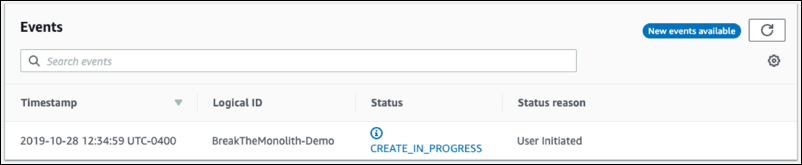

# 使用AWS CloudFormation启动ECS集群

创建一个部署在 Application Load Balancer 后面的 Amazon ECS 集群。

1. 导航至 [AWS CloudFormation 控制台](https://console.aws.amazon.com/cloudformation/home)。

2. 选择**创建堆栈**。

3. 选择**Amazon S3 URL**，其中Amazon S3 URL为：https://xiaoyj.s3.us-east-2.amazonaws.com/container-day/ecs.yml, 然后点击**下一步**。

4. 输入*BreakTheMonolith-Demo* 作为堆栈名称。验证其他参数是否具有下列值：

   1. 所需容量 = *2*
   2. 实例类型 = *t2.micro*
   3. 大小上限 = *2*

5. 选择**下一步**。

6. 在**配置堆栈选项**页面，保留默认选项，向下滚动并选择**下一步**。

7. 在**审查 BreakTheMonolith-Demo** 页面上向下滚动到页面底部，选中复选框确认**功能**声明，并选择**创建堆栈**。

   

您将看到状态为 CREATE_IN_PROGRESS 的堆栈。您可以选择屏幕右上角的“刷新”按钮查看进度。此过程通常需要不到 5 分钟的时间。

