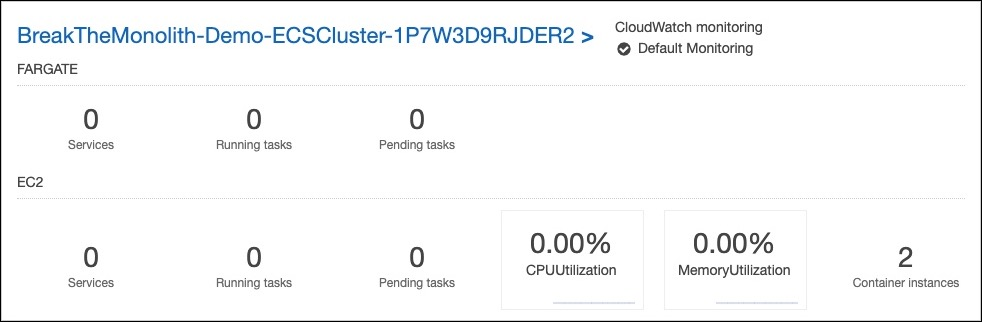
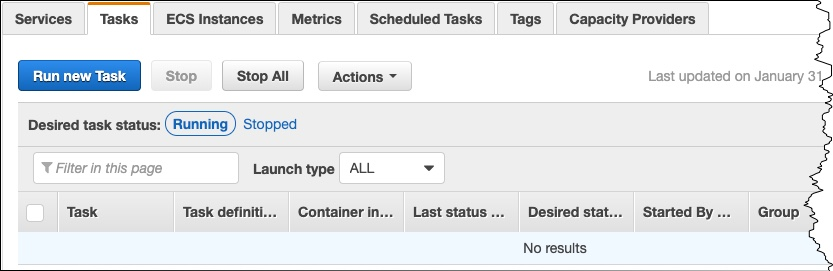
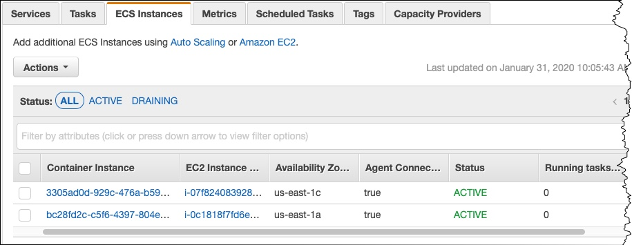

# 检查您的集群是否正在运行

导航到 [Amazon ECS 控制台](https://console.aws.amazon.com/ecs/home?)。
您的集群应该会显示在列表中。

在 **BreakTheMonolith-Demo** 下选择集群，然后选择**任务**选项卡以验证没有正在运行的任务。

选择 **ECS 实例**选项卡以验证有两个由 AWS CloudFormation 模板创建的 Amazon EC2 实例。
**⚐ 注意：**如果您收到显示 ECS 代理已过时的消息，请选择**了解详情**获取更新 ECS 代理的说明。

