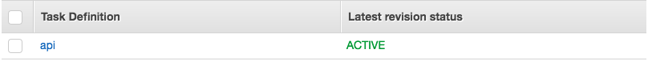

# 编写任务定义

任务定义规定 Amazon ECS 如何在集群间部署应用程序容器。

- 从 **Amazon ECS** 左侧导航菜单中选择**任务定义**。

- 选择**创建新任务定义**。

- 在**选择启动类型兼容性**页面中，选择 **EC2** 选项，然后选择**下一步**。

- 在

  配置任务和容器定义

  页面上执行以下操作：

  - 在**任务定义名称**字段中输入 *api*。

  - 向下滚动至**容器定义**并选择**添加容器**。

  - 在

    添加容器

    窗口中：

    - 未定义的参数可留空白或使用默认设置。
    - 在**容器名称**字段中输入 *api*。
    - 在**映像**字段中输入 *[account-ID].dkr.ecr.us-east-1.amazonaws.com/api:v1*
      将 *[account-ID]* 替换为您的具体信息。请确保标签 *v1* 与您在模块 1 中用于标记的值一致，并推送映像。这是在上一个模块中创建的 ECR 存储库映像的 URL。
    - 在**内存限制**字段，验证**硬限制**已选中，然后输入 *256* 作为值。
    - 在**端口映射**下，主机端口 = *0* 且容器端口 = *3000*。
    - 滚动至 **ENVIRONMENT**，CPU 单元 = *256*。

- 选择**添加**。
  返回到**配置任务和容器定义**页面。

- 转至页面底部，然后选择**创建**。

您的任务定义将列在控制台中。

