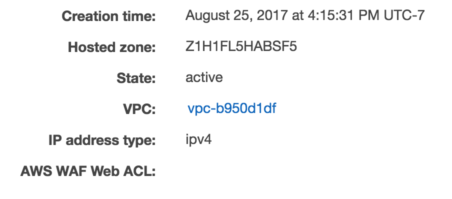
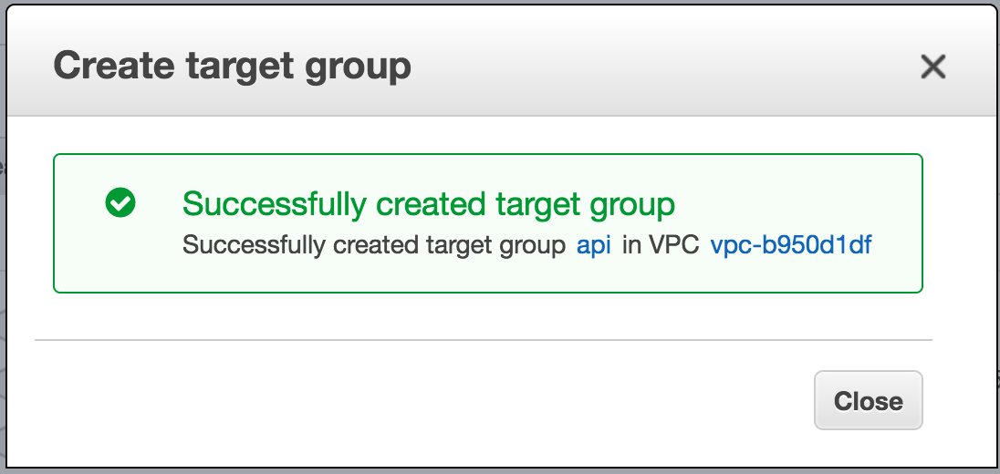

# 配置Application Load Balancer 目标组

[Application Load Balancer (ALB)](http://docs.aws.amazon.com/elasticloadbalancing/latest/application/introduction.html) 可让您的服务接受传入流量。ALB 会自动将流量路由到在集群上运行的容器实例（使用容器实例作为[目标组](http://docs.aws.amazon.com/elasticloadbalancing/latest/application/load-balancer-target-groups.html)）。

**查看您的 VPC 名称：**如果您不是第一次使用此 AWS 账户，则可能拥有多个 VPC。请务必使用正确的 VPC 配置您的目标组。

- 导航到 [EC2 控制台的“负载均衡器”部分](https://console.aws.amazon.com/ec2/v2/home?#LoadBalancers:)。
- 找到名为 **demo** 的负载均衡器。
- 选中 **demo** 旁边的复选框以查看该负载均衡器的详细信息。
- 在**描述**选项卡中，找到 **VPC** 属性（格式为：vpc-xxxxxxxxxxxxxxxxx）。
  **⚐ 注意：**在下一步配置 ALB 目标组时，您需要 VPC 属性。

**配置 ALB 目标组**

- 导航到 [EC2 控制台的“目标组”部分。](https://console.aws.amazon.com/ec2/v2/home?#TargetGroups:)

- 选择**创建目标组**。

- 配置以下目标组参数（下方未列出的参数，请保持默认值）：

  - 对于**目标组名称**，请输入 *api*。

  - 对于**协议**，请输入 **HTTP**。

  - 对于**端口**，请输入 *80*。

  - 请选择与负载均衡器中相匹配的 VPC 值。这很可能不是您的默认 VPC。

  - 访问

    高级运行状况检查设置

    ，并根据需要编辑以下参数： 

    - 对于**正常运行阈值**，请输入 *2*。
    - 对于**运行不正常阈值**，请输入 *2*。
    - 对于**超时**，请输入 *5*。
    - 对于**时间间隔**，请输入 *6*。

- 选择**创建**。

