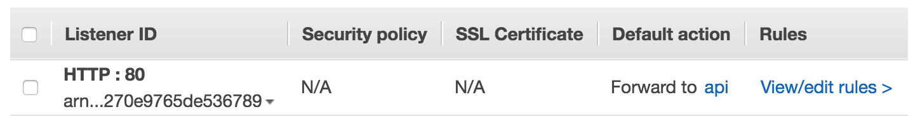

# 配置Application Load Balancer侦听器

ALB [侦听器](http://docs.aws.amazon.com/elasticloadbalancing/latest/application/load-balancer-listeners.html)会查看指向您的 ALB 的传入连接请求。

**将侦听器添加到 ALB**

- 导航到 [EC2 控制台的“负载均衡器”部分](https://console.aws.amazon.com/ec2/v2/home?#LoadBalancers:)。

- 选中 **demo** 旁边的复选框以查看该负载均衡器的详细信息。

- 选择**侦听器**选项卡。

- 选择

  添加侦听器

  并根据需求编辑以下参数：

  - 对于**协议:端口**，请选择 **HTTP**，并输入 *80*。
  - 对于**默认操作**，请选择**转发至**，然后在**目标组**字段，输入 *api*。

- 选择**保存**。

