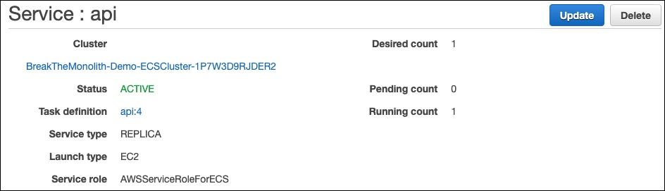

# 以服务的形式部署应用程序

以服务的形式将整体式架构部署到集群中。

- 导航到 [Amazon ECS 控制台](https://console.aws.amazon.com/ecs/home?)，然后从左侧菜单栏中选择**集群**。

- 选中集群 **BreakTheMonolith-Demo**，选择**服务**选项卡，然后选择**创建**。

- 在

  配置服务

  页面上，编辑以下参数（并保留下面未列出参数的默认值）： 

  - 对于**启动类型**，选择 **EC2**。
  - 对于**服务名称**，输入 *api*。 
  - 对于**任务数量**，输入 *1*。
  - 选择**下一步**。

- 在配置网络页面上的负载均衡部分，选择**Application Load Balancer**。

  将会出现其他参数：服务 IAM 角色和负载均衡器名称。

  - 对于**服务 IAM 角色**，选择 BreakTheMonolith-Demo-ECSServiceRole。
  - 对于**负载均衡器名称**，验证是否已选中 **demo**。

- 在**将容器添加到负载均衡**部分，选择**添加到负载均衡器**。
  系统将显示标记为 **api:3000** 的其他信息。

- 在**api:3000**部分，进行以下操作：

  - 对于**生产侦听器端口**，选择 **80:HTTP**。
  - 对于**目标组名称**，选择您的组：**api**。
  - 选择**下一步**。

- 在**设置 Auto Scaling** 页面上，保留默认设置并选择**下一步**。

- 在**审核**页面上，审核设置，然后选择**创建服务**。

- 在创建了服务后，选择**查看服务**。

  

做得好！ 您现在已拥有正在运行的服务。容器可能要过 1 分钟后才能注册为运行正常，并开始接收流量。