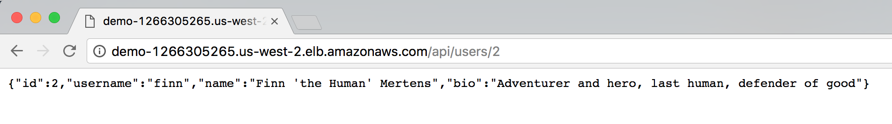

# 测试您的容器化应用程序

通过检查服务能否通过互联网访问并对其执行 ping 操作来验证您的部署。

**要查找您的服务 URL，请执行以下操作：**

- 导航到 EC2 控制台的[负载均衡器](https://console.aws.amazon.com/ec2/v2/home?#LoadBalancers:)部分。
- 选择您的负载均衡器 **demo**。
- 在**描述**选项卡中，复制 DNS 名称并粘贴到新浏览器选项卡或窗口中。
- 您应该会看到一条消息：**Ready to receive requests**（可以接收请求了）。

**查看服务的各个部分：**node.js 应用程序会根据 URL 将流量路由到每个工作线程。要查看工作线程，只需将工作线程名称 *api/[worker-name]* 添加到 DNS 名称的末尾即可，如下所示：

- http://*[DNS name]*/api/users
- http://*[DNS name]*/api/threads
- http://*[DNS name]*/api/posts

您还可以在 URL 的末尾添加记录编号，以细化到特定记录。例如：*http://[DNS name]/api/posts/1* 或 *http://[DNS name]/api/users/2*

